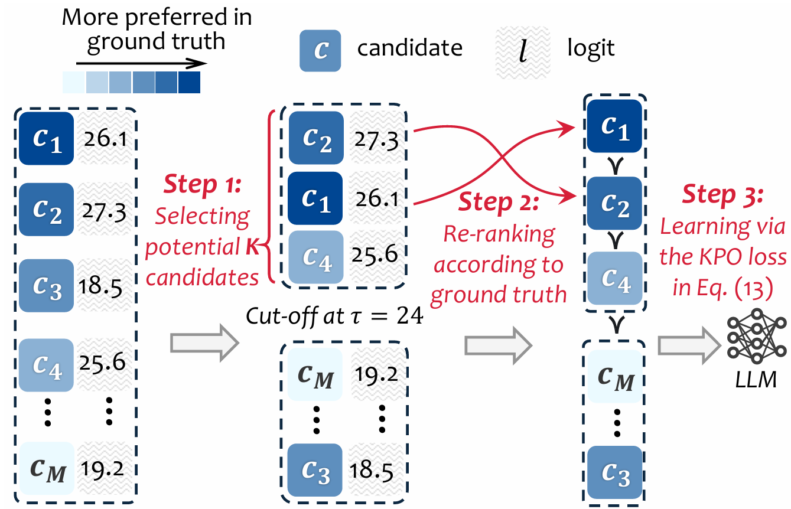
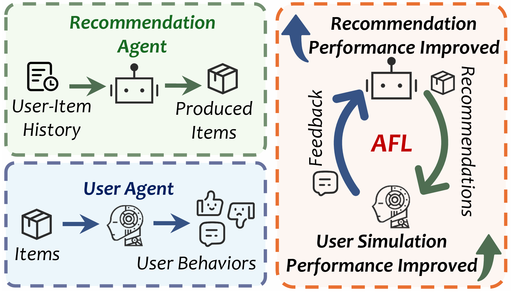
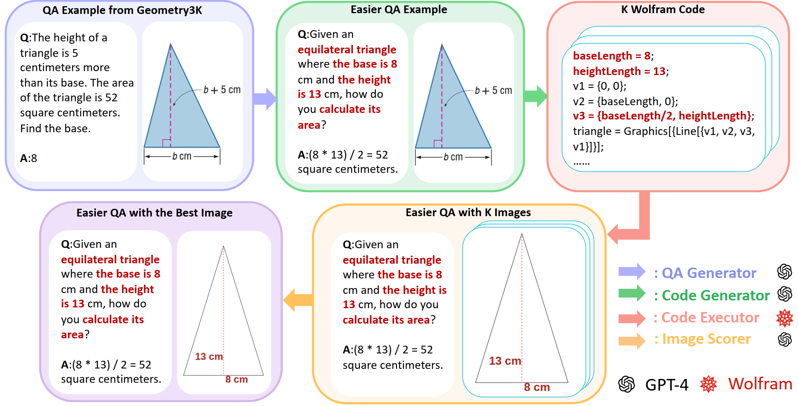

I am a MSc student at [USTC](https://en.ustc.edu.cn/) with research interests in recommender system, LLMs, and MLLMs.

## 📖 Education

  

    <h3 style="margin: 0; margin-bottom: 5px; font-weight: bold;">  University of Science and Technology of China</h3>
    2024.09-Present
  

  
Master in Artificial Intelligence

  

  

    <h3 style="margin: 0; margin-bottom: 5px; font-weight: bold;">  University of Science and Technology of China</h3>
    2020.09-2024.06
  

  
Bachelor in Computer Science

  

## 💻 Internships

  

    <h3 style="margin: 0; margin-bottom: 5px; font-weight: bold;">  Alibaba Taotian</h3>
    2023.11-2024.03
  

  
MLLMs Intern

  

  

    <h3 style="margin: 0; margin-bottom: 5px; font-weight: bold;">  Meituan</h3>
    2023.08-2023.10
  
  
  
LLMs Intern

  

## 📄 Publication

  

    
  

  

    <h3 style="margin: 0; margin-bottom: 5px; font-weight: bold;">K-order Ranking Preference Optimization for Large Language Models</h3>
    
<i>ACL 2025 Findings</i>

    
<b>Shihao Cai</b>, Chongming Gao, Yang Zhang, Wentao Shi, Jizhi Zhang, Keqin Bao, Qifan Wang, Fuli Feng

    

      <a href="https://arxiv.org/pdf/2506.00441" style="margin-right: 10px; padding: 5px 10px; background-color: #2a7ae2; color: white; text-decoration: none; border-radius: 3px;">Paper</a>
      <a href="https://github.com/Lanyu0303/KPO" style="margin-right: 10px; padding: 5px 10px; background-color: #2a7ae2; color: white; text-decoration: none; border-radius: 3px;">Code</a>
    

  

  

    
  

  

    <h3 style="margin: 0; margin-bottom: 5px; font-weight: bold;">Agentic Feedback Loop Modeling Improves Recommendation and User Simulation</h3>
    
<i>SIGIR 2025</i>

    
<b>Shihao Cai</b>, Jizhi Zhang, Keqin Bao, Chongming Gao, Qifan Wang, Fuli Feng, Xiangnan He

    

      <a href="https://arxiv.org/pdf/2410.20027v2" style="margin-right: 10px; padding: 5px 10px; background-color: #2a7ae2; color: white; text-decoration: none; border-radius: 3px;">Paper</a>
      <a href="https://github.com/Lanyu0303/AFL" style="margin-right: 10px; padding: 5px 10px; background-color: #2a7ae2; color: white; text-decoration: none; border-radius: 3px;">Code</a>
    

  

  

    
  

  

    <h3 style="margin: 0; margin-bottom: 5px; font-weight: bold;">GeoGPT4V: Towards Geometric Multi-modal Large Language Models with Geometric Image Generation</h3>
    
<i>EMNLP 2024</i>

    
<b>Shihao Cai</b>*,Keqin Bao*,Hangyu Guo,Jizhi Zhang,Jun Song,Bo Zheng

    

      <a href="https://arxiv.org/pdf/2406.11503" style="margin-right: 10px; padding: 5px 10px; background-color: #2a7ae2; color: white; text-decoration: none; border-radius: 3px;">Paper</a>
      <a href="https://github.com/Lanyu0303/GeoGPT4V_Project" style="margin-right: 10px; padding: 5px 10px; background-color: #2a7ae2; color: white; text-decoration: none; border-radius: 3px;">Code</a>
    

  

